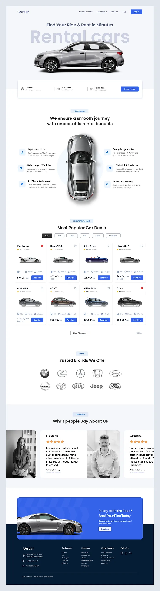
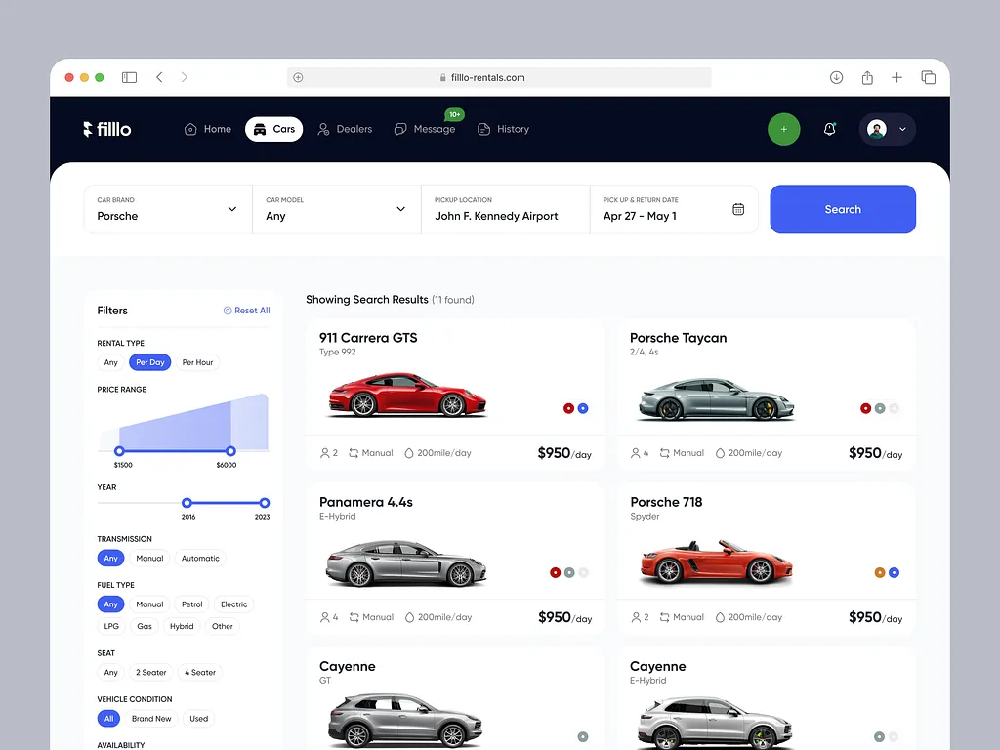
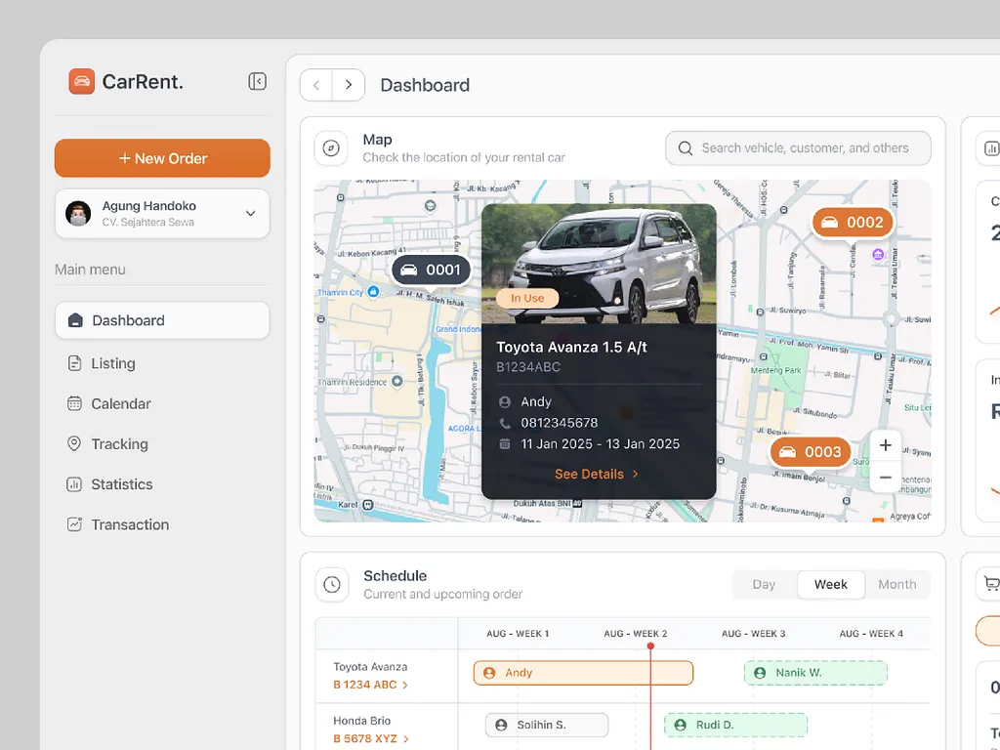

# RentE — Premium Car Rental & Fleet Discovery Platform 🚗⚡

[](https://nextjs.org/)
[](https://react.dev/)
[](https://www.typescriptlang.org/)
[](https://tailwindcss.com/)
[](https://leafletjs.com/)
[](https://github.com/aeskafi/RentE)
[](LICENSE)

**RentE** is a modern, responsive, and production-grade Car Rental & Fleet Discovery SaaS platform. Built with **Next.js 16 (App Router)**, **React 19**, **Tailwind CSS v4**, and **Leaflet Maps**, it bridges physical rental offices (Hubs) and pickup-ready individual listings under a cohesive royal cobalt-blue design identity.

---

## 📸 Visual Gallery & Architecture

| Public Landing Experience | Fleet Search & Filters | Telemetry Admin Dashboard |
| :---: | :---: | :---: |
|  |  |  |

---

## ⚡ Core Features

- **🌐 Unified Global Navigation:** Persistent frosted-glass header with light/dark theme toggles, interactive notifications drawer (unread counts, mark-all-read), and user portal links.
- **🔍 Responsive Search & Filter Grid:** Comprehensive multi-parameter filtering by vehicle brand, price range, model year, transmission, fuel type, and passenger seat capacity.
- **🗺️ Dual-Layer Leaflet Map Discovery:** Dynamic client-hydrated Leaflet maps featuring custom cobalt-blue price badges for individual cars and distinct hub markers.
- **📊 Stateful Telemetry Admin Dashboard:**
  - **Overview:** Vehicle utilization charts, recent booking transaction ledgers, and live tracking telemetry.
  - **Fleet Listing:** Comprehensive inventory management with instant modal forms to register new vehicles.
  - **Calendar:** Gantt-style booking timeline showing weekly reservations.
  - **Live Tracking:** Real-time location coordinates and route visualization.
  - **Analytics:** Revenue growth indicators and category demand distribution graphs.
  - **Invoices & Transactions:** Financial transaction ledgers with export capabilities.

---

## 🛠️ Technical Highlights & Solved Challenges

1. **Next.js SSR vs. Leaflet Client-Only Imports:**
   - *Challenge:* Leaflet references browser globals (`window`, `document`) upon import, breaking standard Server-Side Rendering (SSR).
   - *Solution:* Deployed dynamic client import wrappers via `next/dynamic` with `{ ssr: false }`, ensuring zero SSR hydration crashes.
2. **Tailwind CSS v4 Class-Based Dark Mode:**
   - *Challenge:* Tailwind v4 defaults dark mode to `prefers-color-scheme` media queries.
   - *Solution:* Implemented custom class variants (`@variant dark (&:where(.dark, .dark *))`) in `app/globals.css`, binding dark tokens to custom properties.
3. **React 19 Compiler & Hydration Optimization:**
   - *Challenge:* Synchronous state updates during hydration and effect lifecycles trigger cascading renders.
   - *Solution:* Re-architected theme initialization, query-sync, and drawer step resets into asynchronous event queues.

---

## 🚀 Getting Started

### Prerequisites

- Node.js 20+ (Node.js 18+ supported)
- npm 10+

### Installation

```bash
# Clone the repository
git clone https://github.com/aeskafi/RentE.git
cd RentE

# Install dependencies
npm install
```

### Development Server

```bash
npm run dev
```

Open [http://localhost:3000](http://localhost:3000) in your browser.

### Quality Assurance & Build

```bash
# Run automated tests
npm test

# Run ESLint validation
npm run lint

# Build production bundle
npm run build

# Start production server
npm run start
```

---

## 📁 Repository Structure

```text
├── app/
│   ├── layout.tsx         # Root layout with fonts & metadata
│   ├── page.tsx           # Public hero landing page
│   ├── cars/page.tsx      # Fleet directory with sidebar filtering
│   ├── map/page.tsx       # Dual-layer interactive map discovery
│   └── admin/page.tsx     # Operator telemetry & fleet management
├── components/
│   ├── Navbar.tsx         # Responsive header & notifications drawer
│   ├── MobileNav.tsx      # Mobile bottom navigation bar
│   ├── DetailDrawer.tsx   # Vehicle specifications & booking modal
│   ├── HubDrawer.tsx      # Rental Hub agency profile & fleet modal
│   ├── SearchFilterBar.tsx# Docked search input with date & location pickers
│   ├── cards/             # Vehicle and Hub card components
│   └── map/               # Client-hydrated Leaflet Map wrappers
├── lib/
│   └── mockData.ts        # Seed data for vehicles, hubs, and metrics
├── tests/
│   └── rental.test.mjs    # Automated unit tests for fleet data & pricing
├── types/
│   └── index.ts           # Strict TypeScript interfaces
├── package.json
└── README.md
```

---

## 👤 Author & Curator

**Arham Eskafi (ارحام اسکافی)**
*Rapid MVP Specialist & Tech Nomad*

- 🌐 Website: [arham.dev](https://arham.dev)
- 🎥 YouTube: [Walk Cook Live (@walkcooklive)](https://youtube.com/@walkcooklive)
- 🐙 GitHub: [@aeskafi](https://github.com/aeskafi)

---

## 📄 License

This project is licensed under the MIT License - see the [LICENSE](LICENSE) file for details.
